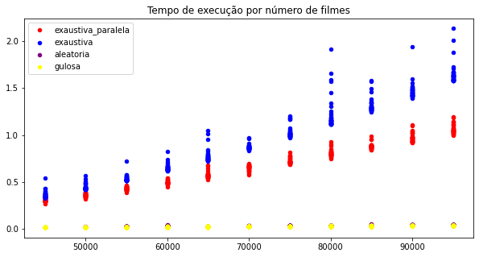

# Projeto SuperComputação

### Os Arquivos:

1. **Input**: arquivos de input no formato “input_N_M.txt”
2. **Output**: aquivos .csv com as saidas de cada heurística no formato [tempo, N, M, score]
3. **Python**: contem 3 arquivos: um que automatiza a criação de inputs, outro para automativar a execução dos algoritimos e um terceiro para a exploração dos dados de saida
4. **CPP:** Os arquivos em C++ com as diferentes implementações das heurísticas
5. [Readme.md](http://Readme.md) e pasta **Img** com as imagems do relatorio

# O Problema:

[https://insper.github.io/supercomp/projetos/](https://insper.github.io/supercomp/projetos/)

## Inputs:

Para os testes das implementações propostas, foram feitos testes com filmes variando de dez mil a cem mil filmes, e entre dez e quarenta categorias, cobrindo todas as 397 combinações possiveis. 

# O código:

Para a resolução do problema, foi primeiro desenvolvido um código generico para tratar as entradas e preparar as estruturas de dados necessarias para a resolução.

Primeiramente foram criadas as variaveis para guardar todos os filmes possiveis `filmes`,  `agenda` para guardar os filmes selecionados pelo algoritimo e `limities` e `cat_gastas`,  com quantos filmes são permitidos por categoria e quantos desses *slots* ja foram utilizados respectivamente

```cpp
vector<filme> filmes;
vector<filme> agenda;
vector<int> limites;
vector<int> cats_gastas(n_cat+1, 0);
int  n_cat;
int n_filmes;

```

Em seguida foi feita a leitura dos *inputs*, começando pleos números de categorias e de filmes, e seguido por dois *loops*, um para ler os limites de cada categoria, e um segundo para ler os dados (inicio, fim e categoria) de cada um dos filmes na lista.

```cpp
cin >> n_filmes >> n_cat;

while(conta<n_cat){
        cin >> lim;
        limites.push_back(lim);
        conta++;
        max_filmes+=lim;}  
 conta = 0;
 int com,fi,c;
 while(conta<n_filmes){
        cin >>com>>fi>>c;
        if (fi <com)
        fi+=24;
        filmes.push_back({com,fi,c,conta});
        conta++;}
```

Fechando a parte padronizada do código, o `vetor filmes`  foi ordenado a partir do horario de incio descente, e como desempate, priorizando filmes mais curtos.

```cpp
bool ordena(filme f1,filme f2){
    if (f1.comeco ==f2.comeco)
    return f1.fim < f2.fim;
    else
    return f1.comeco < f2.comeco; 
}
sort(filmes.begin(), filmes.end(), ordena);
```

A saída do programa também foi padronizada em todos os arquvios, mostrando:

 o tempo em , e os demais dados mostrados no codigo aba

- tempo
    - Medido em nanosegundos passados entre o inicio da função `main` e o fim do *loop* principal
- N_filmes
    - Número N de filmes presentes no *input*
- N_cat
    - Número M de categorias presentes no *input*
- Tamanho
    - Quantidade de filmes selecionados pela heurística

```cpp
auto after = chrono::high_resolution_clock::now();
auto delta = chrono::duration_cast<chrono::nanoseconds>(after-before).count();
cout << delta<< " , " << N << " , " << M << " , "<< 24 << "\n";
```

# As heurísticas:

## Heurística Gulosa:

Uma vez com a lista de filmes devidamente ordenada foi implementado o *loop* principal, que varre todo o vertor de filmes, verificando para cada um se o horario de começo dele ainda não esta ocupado (variavel `hora_atual`) e caso esteja disponivel, faz a validação pela categoria.

Caso ambos os testes sejam vedadeiros, os *slots* da categoria e a hora atual são atualizados, e o filme é adicionado na agenda.

```cpp
int hora_atual=0;
for (auto& x : filmes){
    if(x.comeco >= hora_atual){
        if (cats_gastas[x.cat]+1 <= limites[x.cat]){
            cats_gastas[x.cat]++;
            hora_atual= x.fim;
            agenda.push_back(x);
        }}}
```

### Gulosa invertida:

Foi tambêm criado o arquivo `gulosa_invertida.cpp` no gual durante a ordenação da lista, ao invez serem prioridados filmes mais curtos, passam a ser priorizados filmes mais longos, dado mesmo horario de inicio.

## Aleatorização

A segunda heurística implementada foi a adição de mutações à heurística gulosa, para isso foi criada uma *engine* de numeros pseudo-aleatorios com *seed* constante para padronização dos testes, segindo uma destribuição linear entre 0 e 1.

```cpp
unsigned seed = 10;
default_random_engine generator (seed);
uniform_real_distribution<double> distribution(0.0,1.0);
int hora_atual=0;
double numero;
```

Para o algoritimo ter mais maleabilidade para percorrer o vetor, o *loop for* deixou de iterar sobre itens no vetor, como era na heurística gulosa, e passou a varrer indicies de 0 até a quantidade de filmes menos um.

O *loop* principal tambêm foi alterado para gerar um `numero` aleatorio, com 25% de chance de disparar uma mutação, descrita no primeiro *if*, que consiste em um salto para qualquer filme ainda não contemplado no vetor de filmes 

```cpp
for(int i=0; i < (int)filmes.size(); i++){
        numero =distribution(generator);
        if (numero >= 0.75){
            i+=(rand() % ((int)filmes.size())-i-1 );
        }
        if(filmes[i].comeco >= hora_atual){
            if (cats_gastas[filmes[i].cat]+1 <= limites[filmes[i].cat]){
                cats_gastas[filmes[i].cat]++;
                hora_atual= filmes[i].fim;
                agenda.push_back(filmes[i]);
         }}}
```

### Elatoria invertida:

Foi tambêm criado o arquivo `aleatoria_invertida.cpp` no gual durante a ordenação da lista, ao invez serem prioridados filmes mais curtos, passam a ser priorizados filmes mais longos, dado mesmo horario de inicio.

## Busca Exaustiva:

A terceira heurística a ser desenvolvida foi busca exaustiva, que para melhor comparação, foi implementada com e sem paralelização via OpenMp.

A implementação, em ambos os casos, foi feita por meio de uma função recursiva a partir da lista de filmes ja ordenada por ordem de começo. Para isso, foi criado um struct e uma função de apoio, o struct `result` , que armazena quantos filmes foram selecionados e até que horas o dia ja foi preenchido

```cpp
struct result {
    int quant, horas;
};
result maximo(result r1, result r2){
    if (r1.quant >= r2.quant) {return r1;}
    // if (r1.horas >= r2.horas) {return r1;}
    else {return r2;} 
}
```

 

A função principal recebe como argumentos um horario de inicio, a partir do qual podem ser adcionados novos filmes, um vetor com quando filmes ainda cabem por categoria e o vetor com os filmes ainda disponiveis.

```cpp
result exaustiva(int horario, vector<int>& lim, vector <filme>& filmes){
    if (filmes.empty() || horario==0) return result ({0,0});//condição de parada
```

Por ser uma função recursiva, começa-se com as duas condições de parada existentes nessa formulação. Ou não tem-se mais filmes para adcionar, ou chega-se na hora 0 e nenhum filme começa antes desse horario. Caso uma dessas condições seja cumprida, retornamos um `struct` **do tipo `result` **com nenhum filme e hora 0. **

Em seguida é feita a verificação se o filme ainda é passivel de ser adcionado na agenda, e caso não possa, entramos no `if`**,** onde o filme é retirado da lista e a função retorna sua primeira chamada recursiva, com o mesmo valor de `horario` **e `limites` que foram passados como argumentos.

```cpp
    if (filmes[0].fim>horario || lim[filmes[0].cat]== 0 ){ //nao cabe
        filmes.erase(filmes.begin());
        return exaustiva(horario,lim, filmes);
    }
```

Caso o filme possa ser adcionado à agenda, entramos no `else`***,*** ponto no qual também é implementada a paralelização na execução. Nesse ponto do código, primeiros retiramos o filme da lista, uma vez que ele não deve ser analisado nas proximas recurções, e criamos um novo vetor para carregar os limites, nesse caso considerando que o filme foi incluido na solução

```cpp
else {
        filme f0 = filmes[0];
        filmes.erase(filmes.begin());
        vector<int> lim0 = lim;
        lim0[filmes[0].cat]-=1;
```

Com as devidas alterções feitas, criamos a seção paralela com a diretiva `#pragma omp parallel`

dentro da qual criamos duas *tasks*, com acesso as variaveis `rec` e `rec2` para guardarem os resultados das recuções. A primeira `task` é responsavel pelo cenario onde o filme entra na agenda, portanto passa seu horario de inicio como novo limite, e o vetor de limites atualizado na categoria do filme em questão. A segunda `task`  segue sem que o filme seja adcionado, com a chamda similar a quando o filme não é aceito na agenda.

```cpp
        result rec, rec2;
        #pragma omp parallel
            {
                #pragma omp task shared(rec)
                {
                rec = exaustiva(f0.comeco,lim0, filmes);
                }
                #pragma omp task shared(rec2)
                {
                rec2 = exaustiva(horario,lim, filmes);
                }
            }
```

Tendo em mãos os resultados das duas chamadas, basta adicionar o filme analisado à variavel `rec`, compara-la com o valor devolvido em `rec2` e retornar tal valor, finalizando a execução da função.

```cpp
                rec.horas += (f0.fim - f0.comeco);
                rec.quant +=1;
                rec = maximo(rec, rec2);
    }
return rec;
}
```

Vale ressaltar que foi também cridado uma implementação praticamente igual, apenas sem a parelização, com as recurções todas em uma única *thread*, para a melhor visualização do impacto da paralelização sobre o código.

## Metodo dinamico com GPU:

Para deixarmos de trabalhar no ambito da CPU e passarmos a utilizar a GPU, utilizamos uma abordagem de programação dinamica, utilizando uma matriz de tamanho N+1 por M+1, e um functor responsavel por operar esses pontos. Para aumentar a vasão de dados, foi preciso mudar a lista de *input* para dados menores, para evitarmos problemas de memória, dessa forma os *inputs* para os quais rodamos os programas trabalham com entre dez e cem filmes e cinco e quinze categorias.

A respeito do código, agora deixamos de utilizar os objetos do tipo  `filme` e passamos a trabalhar com 3 `hort_vecotor`, salvos em CPU para recebermos os inputs, e depois transferimos esses dados para a GPU via mais 3 `device_vecotor`.

```cpp
		int N; // Number of elements in categories and end_times
    int M;  // Number of columns in dp array
    std::cin >> N >> M;

    // Input data
    thrust::host_vector<int> categories(N) ;
    thrust::host_vector<int> end_times(N) ;
    thrust::host_vector<int> start_times(N) ;
    thrust::host_vector<int> dp((N + 1) * (M + 1));
    thrust::host_vector<int> L(M);

    int  conta = 0;
    int  lim   =0;
    while(conta<M){
            std::cin >> lim;
            L[conta] = lim;
            conta++;
        }

    conta = 0;
    int i1, i2, i3;
    while(conta<N){
            std::cin >> i1 >> i2 >> i3;
            start_times[conta] = i1;
            end_times[conta] = i2;
            categories[conta] = i3;
            conta++;
        }

    // Transfer input data to device
    thrust::device_vector<int> d_categories = categories;
    thrust::device_vector<int> d_end_times = end_times;
    thrust::device_vector<int> d_start_times = start_times;
    thrust::device_vector<int> d_dp = dp;
    thrust::device_vector<int> d_L = L;

```

Em seguida precisamos iniciar a matriz dp de forma adequada e para suporte, também inicializamos o `thrust::counting_iterator` utilizado para varresmos todos os pontos de `dp`

```cpp
		thrust::fill(d_dp.begin(), d_dp.begin() + M + 1, 1);
    int numElements = ((N + 1) * (M + 1));
    thrust::counting_iterator<int> first;
    thrust::counting_iterator<int> last = first + numElements;
```

O próximo passo seria a utilização do *functor*, e, por motivos de clareza, essa parte será analisada depois. Por hora, basta entendermos que após a função do functor de aplicada a matriz, assim, restará apenas buscar o valor de saída com o tamanho da agenda.

```cpp
    int max_count = 0;
    for (int j = 1; j <= M; j++) {
      max_count = max(max_count, dp[(N*(M+1)) + j]);
      //std::cout<< ((N*(M+1)) + j)<< std::endl;
    }
    auto after = chrono::high_resolution_clock::now();
    auto delta = chrono::duration_cast<chrono::nanoseconds>(after-before).count();
    std::cout << delta << " , " << N<< " , " << M<< " , "<< max_count << "\n";
```

Quanto ao *functor*, primeiros temos q definir os ponteiros para os vetores necessários, com a marcação `int*` e o valor inteiro de M, utilizado como constante.

```cpp
struct UpdateFunctor
{
    int* categories;
    int* end_times;
    int* start_times;
    int* dp;
    int* L;
    int M;

    __host__ __device__
    UpdateFunctor(int* _categories, int* _end_times, int* _start_times, int* _dp, int* _L, int _M)
        : categories(_categories), end_times(_end_times), start_times(_start_times), dp(_dp), L(_L), M(_M)
    {}
```

Uma vez definidas as variaveis, precisamos criar o `Operator` que executara o código, com as tags `__host__ __device__`, por a função vai ser chamada na CPU e executada na GPU, precisando assim de ambas as tags. Nesses caso, a variave `i` já é passada como *input* para o codigo, e `j` é calculado logo no inicio, a partir da onde executamos um loop como instruído pelo professor [no enunciado](https://insper.github.io/supercomp/projetos/gpu/).

```cpp
__host__ __device__
    int operator()(int i) const
    {
        int max_count = 0;
        int j = threadIdx.x + blockIdx.x * blockDim.x;

        for (int k = 0; k < i; k++)
        {
            if (categories[k] == j && end_times[k] <= start_times[i] && dp[(k * (M + 1)) + j - 1] + 1 <= L[j - 1])
            {
                max_count = max(max_count, dp[(k * (M + 1)) + j - 1] + 1);
            }
            else
            {
                max_count = max(max_count, dp[(k * (M + 1)) + j]);
            }
        }

        dp[(i * (M + 1)) + j] = max_count;
        return max_count;
    }
```

Na `Main`, para utilizamos o `UpdateFunctor`, podemos separar em duas etapas, primeiro criamos o objeto passando como input os ponteiros da biblioteca `thrust` para os `device_vecotor`. No segundo momento, utilizamos o método  `thrust::transform` e os iteradores para aplicarmos o *operator* do *functor* para todos os pontos da matriz.

```cpp
UpdateFunctor functor(thrust::raw_pointer_cast(d_categories.data()),
                           thrust::raw_pointer_cast(d_end_times.data()),
                           thrust::raw_pointer_cast(d_start_times.data()),
                           thrust::raw_pointer_cast(d_dp.data()),
                           thrust::raw_pointer_cast(d_L.data()),
                           M);

     thrust::transform(thrust::counting_iterator<int>(0), thrust::counting_iterator<int>(numElements), d_dp.begin(), functor);
```

# Comparações:

## Valgrind

A análise feita pelo valgrind na heurística gulosa apountou como maior gargalo de acessos à memoria a função de ordenação usada sobre o vetor de filmes, outro gargalo foi a função `cin` utiliizada para ler o arquivo de input, que poderia ser trocada por um acesso direto ao arquivo em uma futura iteração.

```cpp
888,497  bool ordena(filme f1,filme f2){
888,527      if (f1.comeco ==f2.comeco)
2,314,284      return f1.fim < f2.fim;
        .      else
1,777,054      return f1.comeco < f2.comeco; 
  888,497  }
```

```cpp
120,004      while(conta<n_filmes){
  540,000          cin >>com>>fi>>c;
206,470,366  => ???:0x0000000000109180 (180,000x)
```

A implementação aleatorizada alem de carregar os gargalos da versão gulosa, teve mais problemas com a mudança do *loop for* principal, que deixou de iterar diretamente sobre o vetor e passou a se basear em marcador de índicie, gerando muitos acessos a memoria para buscar esse marcador e pontos do vetor relativos a ele.

```cpp
1,255,210      for(int i=0; i < (int)filmes.size(); i++){
			.          numero =distribution(generator);
836,804          if (numero >= 0.75){
524,840              i+=(rand() % ((int)filmes.size())-i-1 );
6,494,472  => ???:0x0000000000109170 (104,968x)
.          }
1,673,608          if(filmes[i].comeco >= hora_atual){
25              if (cats_gastas[filmes[i].cat]+1 <= limites[filmes[i].cat]){
10                  cats_gastas[filmes[i].cat]++;
5                  hora_atual= filmes[i].fim;
.                  agenda.push_back(filmes[i]);
.              }
.
.          }
.      }
```

## Resultados

Devido às diferenças nos *inputs* já mencionadas, para comparar os resultados foi necessário separar em alguns casos os resultados referentes à aplicação com GPU, assim podendo comparar as outras 4 implementações escolhidas, a exaustiva paralelizada e não paralelizada, e uma versão da heurística gulosa e uma da aleatorizada.



O primeiro grafico analisado foi o de tempo de execução pela quantidade de filmes. Logo de cara podemos notar que os menores tempos pertencem às heurísticas gulosa e aleatorizada, o que era esperado pelo *********trade-off********* que elas trazem ao buscarem eficiência mas não garantirem resultados ideais (discutidos mais a diante).

Olhando para as outras implementações, notamos que os efietos da paralelização sobre a busca exaustiva são amplificados conforme aumentamos a quantidade de filmes, principalmente quando olhamos piores casos. A respeito da resolução com GPU, foi possivel simular o desempenho para os memos *inputs*, utilizando apenas a leitura do input e a função `thrust::transform` para entendermos o comportamento, que conforme o numero de filmes aumentaria, resultando no gráfico logo a baixo.


Ao isolarmos os testes feitos para GPU, podemos notar uma quantidade grande de *outliers,* chegando a ter 50% a mais de tempo de execução em relação a media de pontos com a mesma quantidade de filmes. Juntando esses dados com o gráfico a respeito das outras heurísticas, notamos que o tempo para a GPU pouco muda conforme cresce o numero de filmes, e considerando que as medidas de tempo consideram o necessario para realizar a leitura dos dados de entrada, podemos validar novamente a perpectiva mostrada pelo grafico acima de um bom desempenho comparadiso da solução com GPU


Quando *plotamos* o tempo de execução pelo número de categorias podemos observar principalmente a falta de um movimento dos pontos conforme a progreção do grafico, mostrando o baixo impacto das categorias na complexidade temporal dos códigos.


Ao analisarmos o *Score* (quantos filmes foram inceridos na agendade saída) pela quantidade de filmes, notamos como de fato as heurísticas gulosa e aleatorizada tem um desempenho muito inferior, e que ouveram também alguns *outliers* na implementação exaustiva paralela, enquanto a  exaustiva sem OpenMP teve o desempeho mais consistente.


## Resultados Parciais

Em um primeiro momento foi feita a analise isolando as possiveis quantidades de filmes e de categorias, obtendo inicialmente graficos do tempo gasto total para cada quantidade de filmes independente do numero de categorias, e depois para cada quantidade de categorias independente do numero de filmes.

Com esses dois primeiros graficos notamos que a heurística gulosa foi muito mais impactada pela priorização de filmes mais curtos feita incialmente, enquanto o algoritimo aleatorizado pouco sentiu diferença nessa questão


Olhando agora para a saida criada por cada algoritmo, notamos que a heurística gulosa tem um desempenho muito bom no quesito tempo de tela, enquanto a heurística aleatorizada é beneficiada ao preferir filmes mais curtos, apesar de nos dois casos o numero de filmes escolhidos ser bem parecido.


