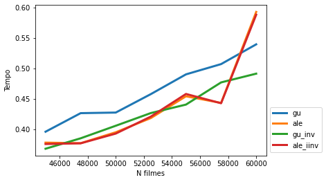
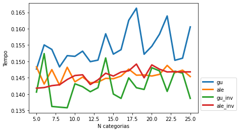
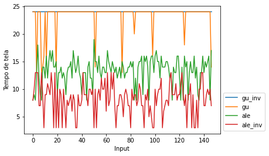
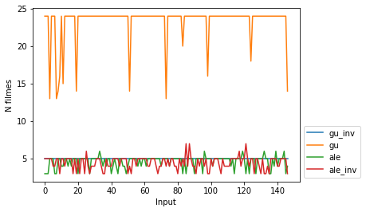
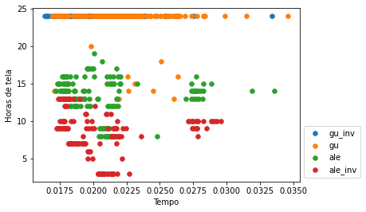
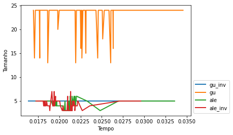

# Relatorio Parcial

### Os Arquivos:

1. **Input**: arquivos de input no formato “input_N_M.txt”
2. **Output**: contem 4 pastas, que separam os arquivos de saída por algorítimo de criação
3. **Python**: contem 3 arquivos: um que automatiza a criação de inputs, outro para automatizar a execução dos algorítimos e um terceiro para a exploração dos dados de saída
4. Os 4 arquivos em C++ com as diferentes implementações das duas heurísticas
5. Readme.md

# O Problema:

[https://insper.github.io/supercomp/projetos/](https://insper.github.io/supercomp/projetos/)

# O código:

Para a resolução do problema, foi primeiro desenvolvido um código genérico para tratar as entradas e preparar as estruturas de dados necessárias para a resolução.

Primeiramente foram criadas as variáveis para guardar todos os filmes possíveis `filmes`,  `agenda` para guardar os filmes selecionados pelo algorítimo e `limities` e `cat_gastas`,  com quantos filmes são permitidos por categoria e quantos desses *slots* ja foram utilizados respectivamente

```cpp
vector<filme> filmes;
vector<filme> agenda;
vector<int> limites;
vector<int> cats_gastas(n_cat+1, 0);
int  n_cat;
int n_filmes;

```

Em seguida foi feita a leitura dos *inputs*, começando pleos números de categorias e de filmes, e seguido por dois *loops*, um para ler os limites de cada categoria, e um segundo para ler os dados (inicio, fim e categoria) de cada um dos filmes na lista.

```cpp
cin >> n_filmes >> n_cat;

while(conta<n_cat){
        cin >> lim;
        limites.push_back(lim);
        conta++;
        max_filmes+=lim;}  
 conta = 0;
 int com,fi,c;
 while(conta<n_filmes){
        cin >>com>>fi>>c;
        if (fi <com)
        fi+=24;
        filmes.push_back({com,fi,c,conta});
        conta++;}
```

Fechando a parte padronizada do código, o `vetor filmes`  foi ordenado a partir do horário de incio descente, e como desempate, priorizando filmes mais curtos.

```cpp
bool ordena(filme f1,filme f2){
    if (f1.comeco ==f2.comeco)
    return f1.fim < f2.fim;
    else
    return f1.comeco < f2.comeco; 
}
sort(filmes.begin(), filmes.end(), ordena);
```

A saída do programa também foi padronizada em todos os arquivos, mostrando:

 o tempo em , e os demais dados mostrados no código aba

- tempo
    - Medido em nanosegundos passados entre o inicio da função `main` e o fim do *loop* principal
- Max_filmes
    - Número máximo de filmes possíveis pelo limite das categorias somados
- N_filmes
    - Número N de filmes presentes no *input*
- N_cat
    - Número M de categorias presentes no *input*
- Tamanho
    - Quantidade de filmes selecionados pela heurística
- Tempo_util
    - horas de tela disponível entre os filmes selecionados

```cpp
auto after = chrono::high_resolution_clock::now();
auto delta = chrono::duration_cast<chrono::nanoseconds>(after-before).count();
cout << "Time: " << delta << "\n";
cout << "max " << max_filmes << "\n";
cout << "N_filmes " << n_filmes << "\n";
cout << "N_cat " << n_cat << "\n";
cout << "TAMANHO " << agenda.size() << "\n";

int tempo_util = 0;
for (auto& x : agenda)
	tempo_util += abs(x.comeco - x.fim);
cout << "TEMPO: " << tempo_util << "\n";

```

# As heurísticas:

## Heurística Gulosa:

Uma vez com a lista de filmes devidamente ordenada foi implementado o *loop* principal, que varre todo o vetor de filmes, verificando para cada um se o horário de começo dele ainda não esta ocupado (variável `hora_atual`) e caso esteja disponível, faz a validação pela categoria.

Caso ambos os testes sejam verdadeiros, os *slots* da categoria e a hora atual são atualizados, e o filme é adicionado na agenda.

```cpp
int hora_atual=0;
for (auto& x : filmes){
    if(x.comeco >= hora_atual){
        if (cats_gastas[x.cat]+1 <= limites[x.cat]){
            cats_gastas[x.cat]++;
            hora_atual= x.fim;
            agenda.push_back(x);
        }}}
```

### Gulosa invertida:

Foi também criado o arquivo `gulosa_invertida.cpp` no qual durante a ordenação da lista, ao invés serem priorizados filmes mais curtos, passam a ser priorizados filmes mais longos, dado mesmo horário de inicio.

## Aleatorização

A segunda heurística implementada foi a adição de mutações à heurística gulosa, para isso foi criada uma *engine* de números pseudo-aleatórios com *seed* constante para padronização dos testes, seguindo uma distribuição linear entre 0 e 1.

```cpp
unsigned seed = 10;
default_random_engine generator (seed);
uniform_real_distribution<double> distribution(0.0,1.0);
int hora_atual=0;
double numero;
```

Para o algorítimo ter mais maleabilidade para percorrer o vetor, o *loop for* deixou de iterar sobre itens no vetor, como era na heurística gulosa, e passou a varrer indicies de 0 até a quantidade de filmes menos um.

O *loop* principal também foi alterado para gerar um `numero` aleatório, com 25% de chance de disparar uma mutação, descrita no primeiro *if*, que consiste em um salto para qualquer filme ainda não contemplado no vetor de filmes 

```cpp
for(int i=0; i < (int)filmes.size(); i++){
        numero =distribution(generator);
        if (numero >= 0.75){
            i+=(rand() % ((int)filmes.size())-i-1 );
        }
        if(filmes[i].comeco >= hora_atual){
            if (cats_gastas[filmes[i].cat]+1 <= limites[filmes[i].cat]){
                cats_gastas[filmes[i].cat]++;
                hora_atual= filmes[i].fim;
                agenda.push_back(filmes[i]);
         }}}
```

### Elatoria invertida:

Foi também criado o arquivo `aleatoria_invertida.cpp` no qual durante a ordenação da lista, ao invés serem priorizados filmes mais curtos, passam a ser priorizados filmes mais longos, dado mesmo horário de inicio.

# Comparações:

## Valgrind

A análise feita pelo *valgrind* na heurística gulosa apontou como maior gargalo de acessos à memoria a função de ordenação usada sobre o vetor de filmes, outro gargalo foi a função `cin` utilizada para ler o arquivo de input, que poderia ser trocada por um acesso direto ao arquivo em uma futura iteração.

```cpp
888,497  bool ordena(filme f1,filme f2){
888,527      if (f1.comeco ==f2.comeco)
2,314,284      return f1.fim < f2.fim;
        .      else
1,777,054      return f1.comeco < f2.comeco; 
  888,497  }
```

```cpp
120,004      while(conta<n_filmes){
  540,000          cin >>com>>fi>>c;
206,470,366  => ???:0x0000000000109180 (180,000x)
```

A implementação aleatorizada além de carregar os gargalos da versão gulosa, teve mais problemas com a mudança do *loop for* principal, que deixou de iterar diretamente sobre o vetor e passou a se basear em marcador de indicie, gerando muitos acessos a memoria para buscar esse marcador e pontos do vetor relativos a ele 

```cpp
1,255,210      for(int i=0; i < (int)filmes.size(); i++){
			.          numero =distribution(generator);
836,804          if (numero >= 0.75){
524,840              i+=(rand() % ((int)filmes.size())-i-1 );
6,494,472  => ???:0x0000000000109170 (104,968x)
.          }
1,673,608          if(filmes[i].comeco >= hora_atual){
25              if (cats_gastas[filmes[i].cat]+1 <= limites[filmes[i].cat]){
10                  cats_gastas[filmes[i].cat]++;
5                  hora_atual= filmes[i].fim;
.                  agenda.push_back(filmes[i]);
.              }
.
.          }
.      }
```

## Resultados

Em um primeiro momento foi feita a analise isolando as possíveis quantidades de filmes e de categorias, obtendo inicialmente gráficos do tempo gasto total para cada quantidade de filmes independente do numero de categorias, e depois para cada quantidade de categorias independente do numero de filmes.

Com esses dois primeiros gráficos notamos que a heurística gulosa foi muito mais impactada pela priorização de filmes mais curtos feita inicialmente, enquanto o algorítimo aleatorizado pouco sentiu diferença nessa questão





Olhando agora para a saída criada por cada algoritmo, notamos que a heurística gulosa tem um desempenho muito bom no quesito tempo de tela, enquanto a heurística aleatorizada é beneficiada ao preferir filmes mais curtos, apesar de nos dois casos o numero de filmes escolhidos ser bem parecido.








